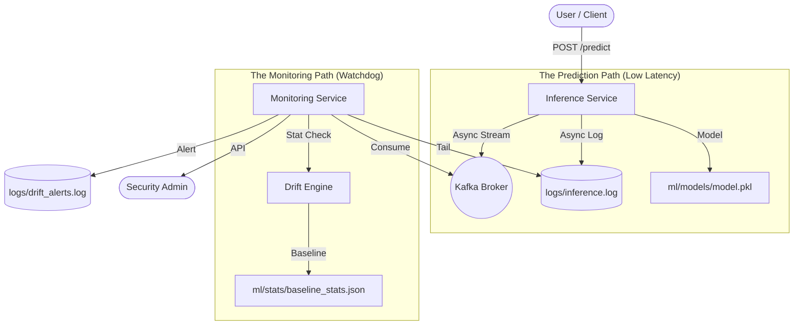

# 🛡️ DriftSentinel — System Architecture

DriftSentinel is a decoupled, production-grade ML monitoring system. It separates the **Inference Path** (Latency-sensitive) from the **Monitoring Path** (Compute-intensive).

## 🛰️ High-Level Blueprint

## 🧩 Component Breakdown

### 1. Inference Service (`services/inference-service`)
- **Role**: The public gateway for model predictions.
- **Goal**: Minimize latency. It performs the prediction and immediately returns the result to the user.
- **Decoupling**: Instead of calculating drift during the request, it logs the data and handoffs the monitoring task to a background service.

### 2. Monitoring Service (`services/monitoring-service`)
- **Role**: The "Watcher" that audits every prediction for statistical anomalies.
- **Background Consumer**: Runs a thread that constantly tails `inference.log`.
- **Sliding Window**: It doesn't store millions of records in memory; it uses a "Sliding Window" (circular buffer) of the last 100 events to compute its statistics.

### 3. Drift Engine (`drift_engine.py`)
- **The Brain**: Uses the **Kolmogorov-Smirnov (KS) Test** to compare the live "Sliding Window" against the "Baseline" (the data the model was trained on).
- **Severity Classifier**: Automatically tags drift as `LOW`, `MEDIUM`, or `HIGH` based on how many features have shifted.

## 🌉 Communication Layers
- **Shared Volume (Development)**: Services share a `/logs` directory. Inference writes; Monitoring tails. This is extremely efficient and works on platforms like Render or local Docker.
- **Kafka (Production)**: For high-scale deployments, the system publishes events to a `inference-events` topic, providing a lossless, distributed stream.

---

## 🎤 Key Architecture Positioning
> “By decoupling the monitoring logic from the prediction logic, DriftSentinel ensures that even intensive statistical checks like the KS-test never slow down the end-user's experience.”
